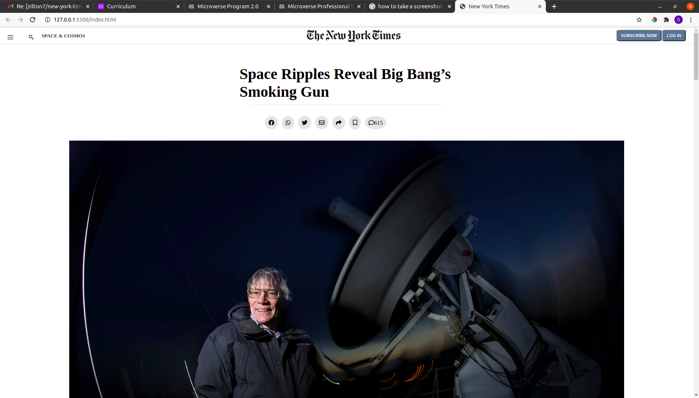

`

# Project Name

> New York Times page
This project is a clone from the New York times page that we made, in order to learn how to use HTML and CSS in order to properly style the page.

There is not many feaures, appart from Microverse's linters.

## Built With

- HTML and CSS

## Live Demo

[Live Demo Link](https://zilton7.github.io/new-york-times)

## Getting Started

**This is instructions on setting up your project locally.**

To get a local copy up and running follow these simple example steps.

* On GitHub, navigate to the main page of the repository.

* Above the list of files, click ↓ Code.

* To clone the repository using HTTPS, under "Clone with HTTPS", click  to clone the repository using an SSH key, including a certificate issued by your organization's SSH certificate authority, click Use SSH, then click to clone a repository using GitHub CLI.

* Open Terminal.

* Change the current working directory to the location where you want the cloned directory.

* Type git clone, and then paste the URL you copied earlier.
$ git clone https://github.com/YOUR-USERNAME/YOUR-REPOSITORY

* Press Enter to create your local clone.
> Cloning into `Spoon-Knife`...
> remote: Counting objects: 10, done.
> remote: Compressing objects: 100% (8/8), done.
> remove: Total 10 (delta 1), reused 10 (delta 1)
> Unpacking objects: 100% (10/10), done.

### Prerequisites

* HTML 

* CSS 

## Author

- GitHub: [@Solenka1](https://github.com/Solenka1)
- Twitter: [@GorgiMitev](https://twitter.com/GorgiMitev)
- LinkedIn: [gorgi-mitev](https://www.linkedin.com/in/gorgi-mitev-a350311b8/)

## 🤝 Contributing

Contributions, issues, and feature requests are welcome!

Feel free to check the [issues page](issues/).

## Show your support

Give a ⭐️ if you like this project! ⭐️

## Acknowledgments

- Hat tip to anyone whose code was used
- Inspiration
- etc

## 📝 License

This project is [MIT](lic.url) licensed.
